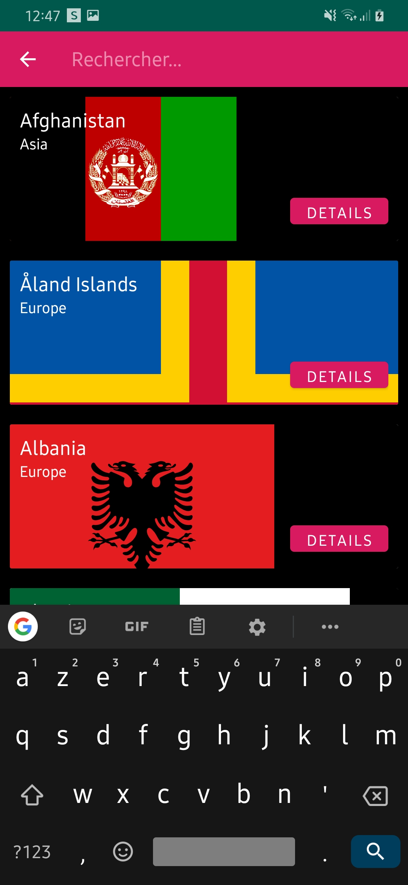
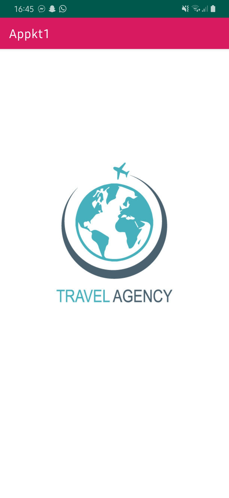
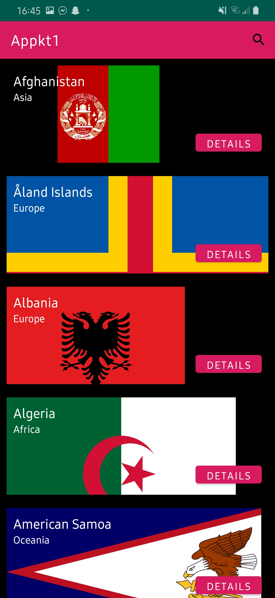
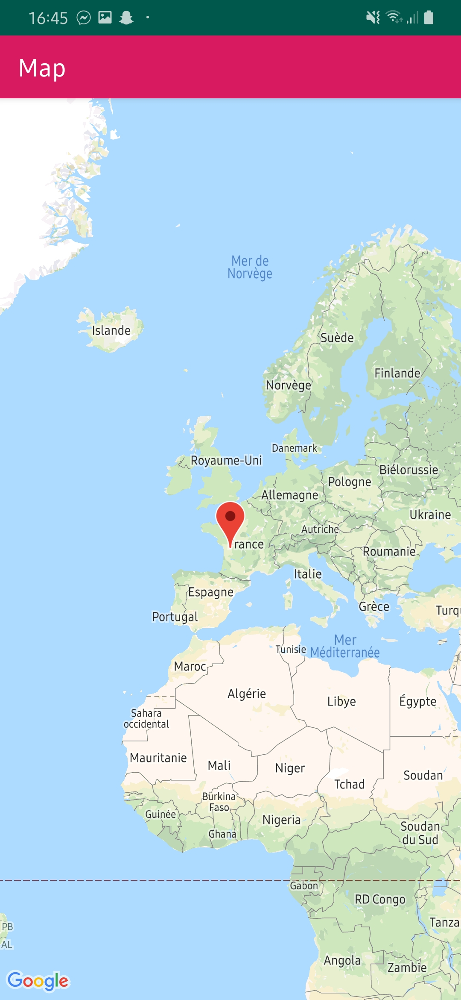
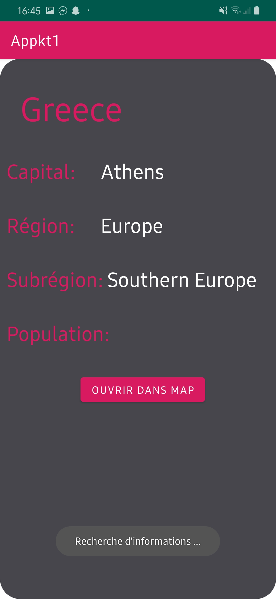

# Appkt1

## Presentation generale:

Réalisation d'une application dans le cadre des cours "appli mobile". Application de de type "agence de voyage" qui permet de retrouver 
des informations sur les differents pays au travers d'une liste.

##  Presentation technique:

```diff
! Architecture: 
```
MVVM (Model View ViewModel), a
simplifie l’écriture des interfaces graphiques
```diff
! Gitflow: 
```
 Master / Develop
 ```diff
! Languages: 
```
kotlin
```diff
! apk building
```
```diff
! Activitées: 
```
Splash/Recycler/Detail/Map
```diff
! Fragments: 
```
Splash/Recycler/RecyclerItem/Details/Maps
```diff
! Data: 
```
l'application recupère le données via une api rest (fichier .json)
```diff
! Données en cache 
```
```diff
! Splashscreen: 
```
Ecran d'acceuil (possiblement de chargement) avec le logo de l'entreprise
```diff
! Recyclerview: 
```
Liste des elements (data.json) chargés dans une liste scrollable
```diff
! Details: 
```
ouverture d'un detail de l'element selectionne sur un clique bouton
```diff
! Maps: 
```
Affichage de l'emplacement du pays selectionné dans maps

## Apports du projet:

- Nouveau language (Kt)
- Meilleure Ui adpatable (Fragments)
- passage de données (intent)
- Api Map 
- Api Rest (countryDb & json)
- Nouvelle architecture (MVVM)

## Aperçu:






